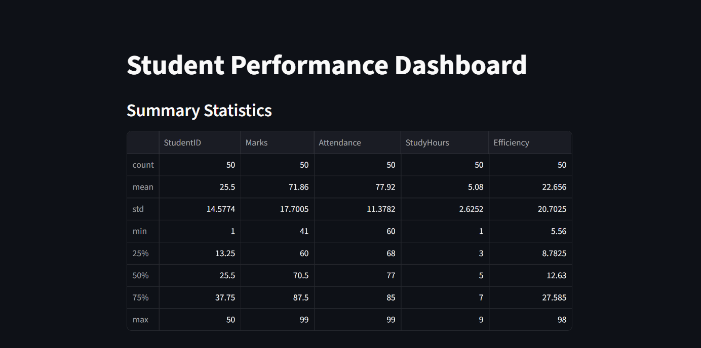
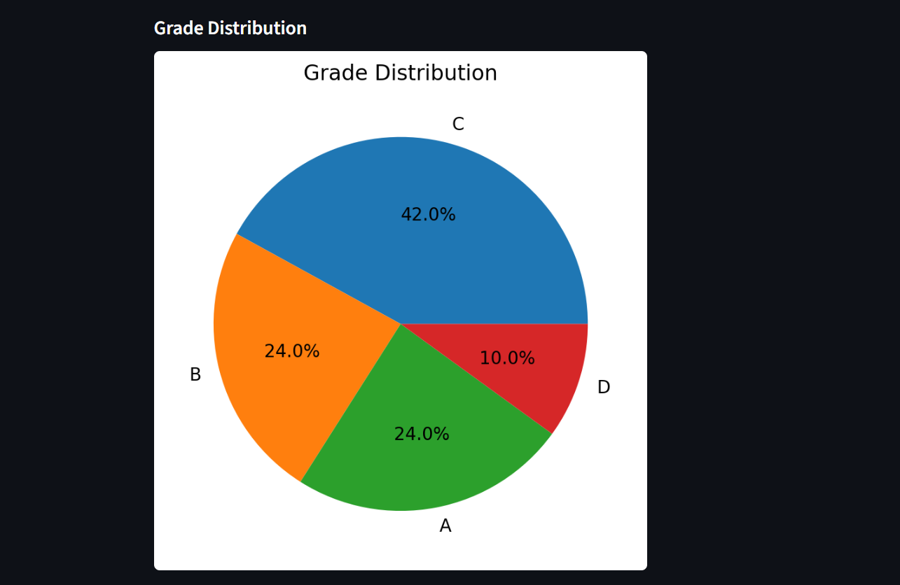
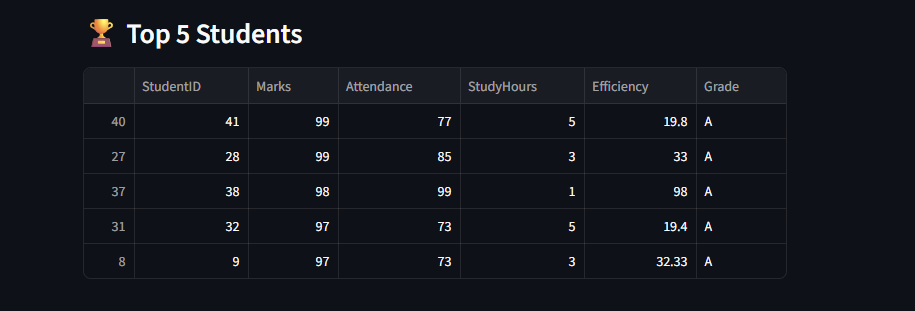

# 📊 Student Performance Analytics Dashboard

An interactive data visualization project built using **Python, Pandas, Matplotlib, and Streamlit**.
This dashboard analyzes student performance based on marks, attendance, study hours, and efficiency.

---

## 🚀 Features

* 📂 Upload and analyze student dataset
* 📊 Visualize performance using charts
* 🎯 Grade distribution analysis
* 📈 Study hours vs marks correlation
* 📉 Attendance vs performance insights
* 🏆 Top-performing students
* 🔍 Filter students by grade

---

## 🛠️ Tech Stack

* **Python**
* **Pandas** – Data processing
* **Matplotlib** – Visualization
* **Streamlit** – Interactive dashboard

---

##  Project Structure

```
 Student-Analytics
 ┣ 📜 app.py
 ┣ 📜 generate_data.py
 ┣ 📜 students.csv
 ┗ 📜 README.md
```

---

## ⚙️ Installation

```bash
pip install streamlit pandas matplotlib
```

---

## ▶️ Run the Project

```bash
streamlit run app.py
```

---

## 📊 Dataset

The dataset contains:

* StudentID
* Marks
* Attendance (%)
* Study Hours
* Efficiency (Marks / StudyHours)
* Grade (A, B, C, D)

You can generate the dataset using:

```bash
python generate_data.py
```

---

##  Screenshots

###  Dashboard Overview



---

###  Grade Distribution



---

###   Marks per student


---

###  Study Hours vs Marks


---

###  Top Students



---

##  Insights

* Students with higher study hours tend to score more marks
* Attendance has moderate impact on performance
* Efficiency helps identify smart study patterns
* Majority of students fall under grade C and B

---

## 🔥 Future Improvements

* Add **interactive charts (Plotly)**
* Integrate **machine learning predictions**
* Add **emotion detection (AI integration)**
* Deploy using **Streamlit Cloud**

---

## 👨‍💻 Author

Your Name

---

## 📄 License

This project is open-source and free to use.
