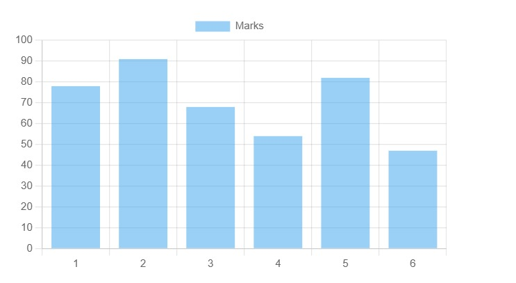
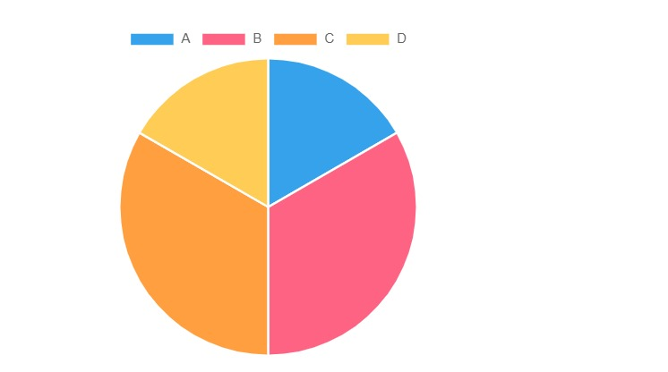
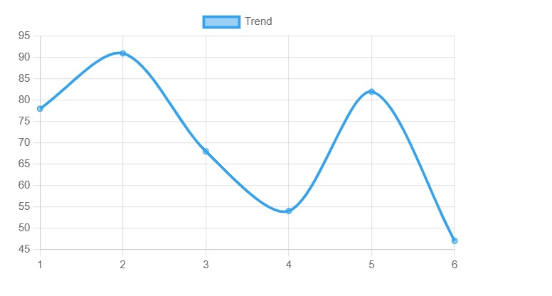
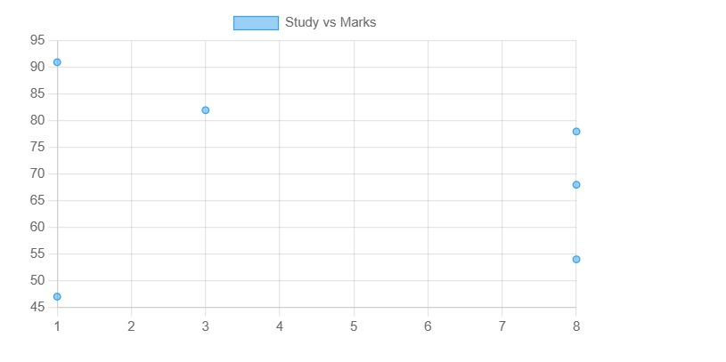

# 📊 Student Dashboard (Chart.js)

A simple and interactive **data visualization dashboard** built using **HTML, JavaScript, and Chart.js**.
This project visualizes student performance using multiple charts in a single web page.

---

## 🚀 Features

* 📊 Bar Chart → Marks per student
* 🥧 Pie Chart → Grade distribution
* 📈 Scatter Plot → Study hours vs marks
* 📉 Line Graph → Marks trend
* ⚡ Lightweight (no backend required)
* 🌐 Runs directly in browser

---

## 🛠️ Tech Stack

* **HTML5**
* **JavaScript**
* **Chart.js**

---

## 📁 Project Structure

```bash
📦 chartjs-student-dashboard
 ┣ 📜 index.html
 ┣ 📜 students.js
 ┗ 📜 README.md
```

---

## 📊 Dataset

The dataset is stored in `students.js` as a JavaScript array.

### Example:

```javascript
const students = [
  {id:1, marks:78, study:8, grade:"B"},
  {id:2, marks:91, study:1, grade:"A"}
];
```

---

## ▶️ How to Run

1. Download or clone the project
2. Open `index.html` in your browser

```bash
# No installation required
```

---

## 📸 Screenshots

---

### 📈 Charts Included

* Bar Chart




* Pie Chart



* Scatter Plot



* Line Graph



---

## 📌 Insights

* Students with more study hours generally score higher
* Grade distribution shows performance levels
* Line graph helps visualize trends across students

---

## 🔥 Future Improvements

* Add **dropdown filters (by grade)**
* Add **colors and themes**
* Use **Bootstrap for better UI**
* Connect to **real backend (Django / API)**

---

## 👨‍💻 Author

Your Name

---

## 📄 License

This project is open-source and free to use.
